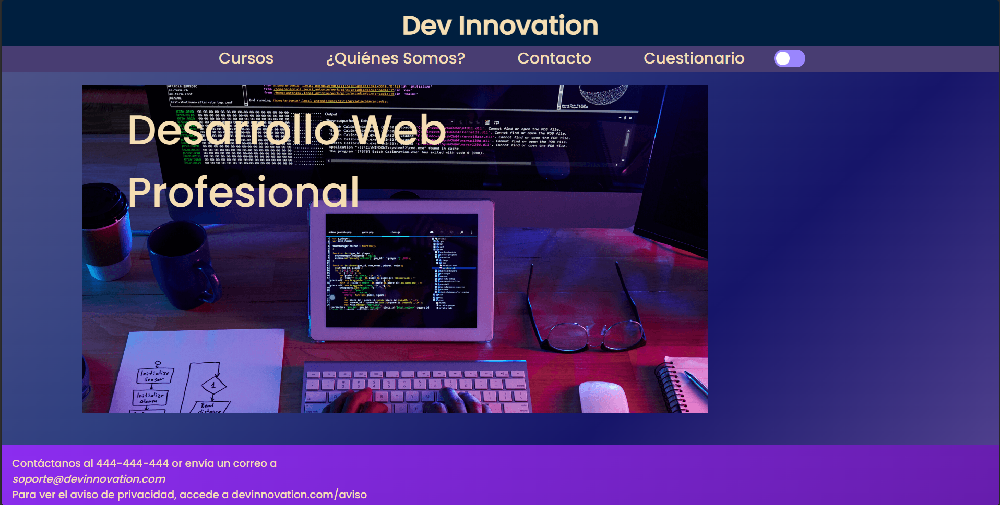

# Web Responsive
## Idea de la web

Mi idea para hacer esta web ha sido finalmente hacer una web básica para una empresa que realiza cursos de desarrollo web.
La página inicial contiene un menú de navegación para ir a la página 'Cursos' y '¿Quienes somos?'.
En la página 'cursos' encontramos los distintos cursos de desarrollo como html,css,js y react.
En la página de '¿Quienes Somos? encontramos un apartado que indica un poco como funciona la empresa y a que se dedica.
Todas tienen un footer con un 'mailto' de contacto.

## Estructura de carpetas
``` bash
| -- css/
|   | -- styles.css
| -- fonts/
|   | -- Poppins-Medium.ttf
| -- html/
|   |-- pagina-ayuda.html
|	|-- pagina-cursos.html
|	|-- pagina-inicio.html
| -- img/
|   | -- css-img.png
|   | -- html-img.png
|   | -- js-img.png
|   | -- portada.png
|   | -- react-img.png
| - - README.md
```
## Teconologias utilizadas
La página web ha sido desarrollada utilizando las siguientes tecnologías:

HTML5: Estructura básica de la página.
CSS3: Estilos y diseño de la página.
## Características y Funcionalidades Principales

La página web presenta las siguientes características y funcionalidades:

Diseño Responsive: La página se adapta a 3 tamaños de pantalla para una experiencia de usuario óptima. Los tamaños son desktop, mobile y tablet.
Navegación Intuitiva: Menús y enlaces que facilitan la navegación del usuario.
Footer con mail de contacto.
Cursos de desarrollo: Sección que muestra cursos de desarrollo con imágenes relacionadas con el contenido.
Animaciones Suaves: Uso de animaciones CSS.

## Capturas de pantalla
- Página de Inicio

- - Menu de navegación

- - Footer

-  Página de Cursos

- - Tarjetas Cursos

- Página de Ayuda

- - Ayuda de ¿Quienes somos?

