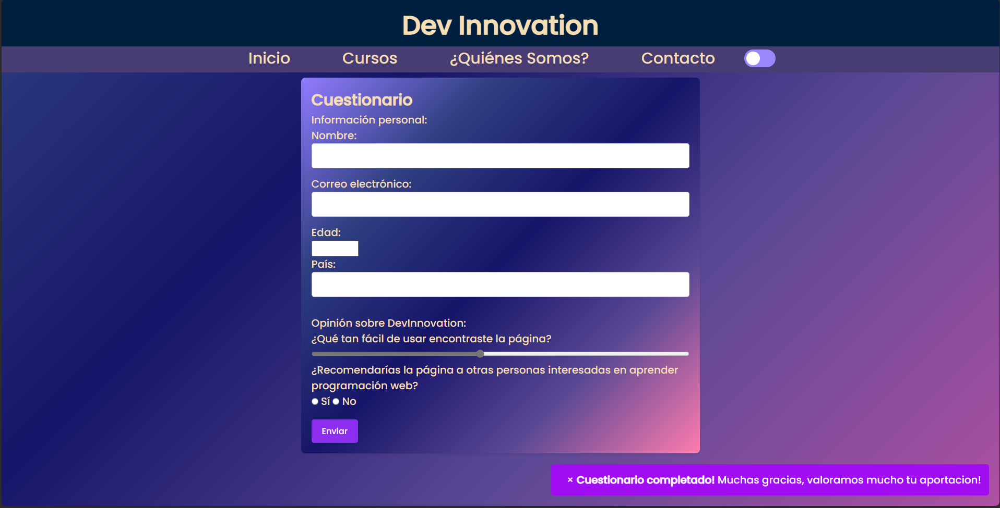
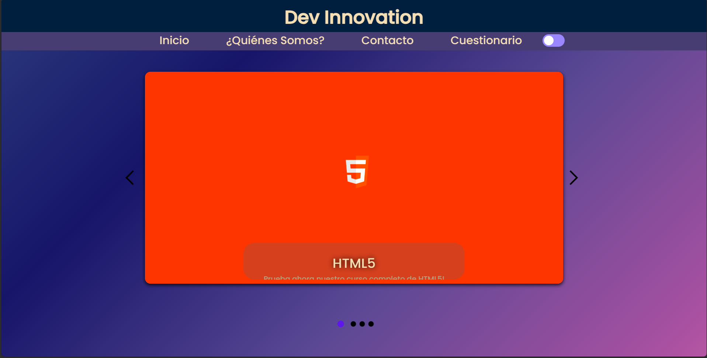
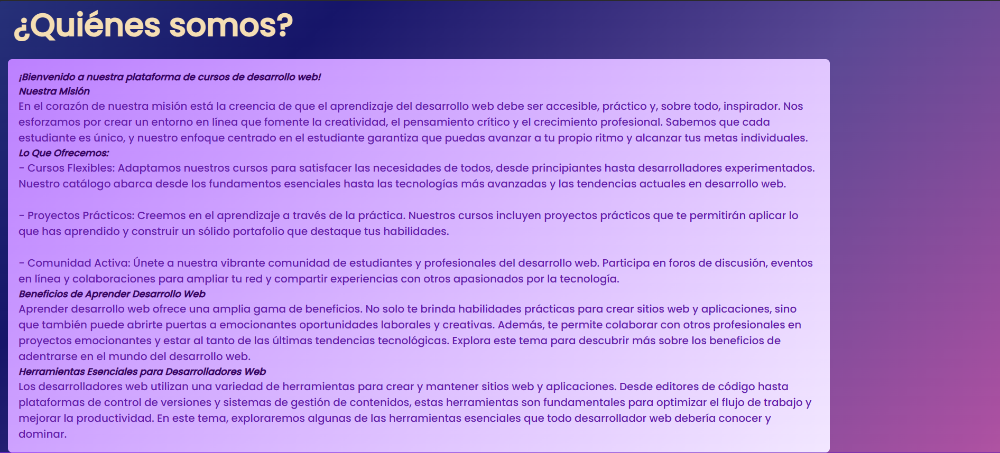
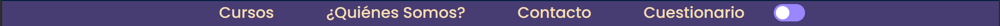

# Web Responsive
## Idea de la web

Mi idea para hacer esta web ha sido finalmente hacer una web básica para una empresa que realiza cursos de desarrollo web.
La página inicial contiene un menú de navegación para ir a la página 'Cursos' y '¿Quienes somos?'.
En la página 'cursos' encontramos los distintos cursos de desarrollo como html,css,js y react.
En la página de '¿Quienes Somos? encontramos un apartado que indica un poco como funciona la empresa y a que se dedica.
Todas tienen un footer con un 'mailto' de contacto.

## Estructura de carpetas
``` bash
| -- css/
|   | -- styles.css
| -- fonts/
|   | -- Poppins-Medium.ttf
| -- html/
|   |-- pagina-ayuda.html
|	|-- pagina-cursos.html
|	|-- pagina-inicio.html
| -- img/
|   | -- css-img.png
|   | -- flecha-derecha.svg
|   | -- flecha-izquierda.svg
|   | -- html-img.png
|   | -- js-img.png
|   | -- portada.png
|   | -- react-img.png
| -- js/
|   | -- script.js
| - - README.md
```
## Teconologias utilizadas
La página web ha sido desarrollada utilizando las siguientes tecnologías:

HTML5: Estructura básica de la página.
CSS3: Estilos y diseño de la página.
Javascript: Funcionalidades interactivas en la página.
## Características y Funcionalidades Principales

La página web presenta las siguientes características y funcionalidades:

Diseño Responsive: La página se adapta a 3 tamaños de pantalla para una experiencia de usuario óptima. Los tamaños son desktop, mobile y tablet.
Navegación Intuitiva: Menús y enlaces que facilitan la navegación del usuario.
Footer con mail de contacto.
Cursos de desarrollo: Sección que muestra cursos de desarrollo con imágenes relacionadas con el contenido.
Animaciones Suaves: Uso de animaciones CSS.
## Interactividad y novedades
### Interactividad
#### Web
La web cuenta con varias novedades interactivas, a simple vista se aprecia un boton en el menú de navegación que permite al usuario cambiar el tema de la página de oscuro a claro y viceversa.


#### Formulario y Cuestionario
Se añaden dos apartados nuevos llamados "Cuestionario" y "Contacto" que son dos formularios, el caso de Cuestionario se utiliza para que el usuario pueda dar feedback a la web sobre su utilidad entre otras cosas, el caso Formulario es un formulario de contacto útil para poder enviar mensajes a la empresa sobre dudas o problemas. 



Ambos formularios presentan una caracterísitca especial y es que al completar con exito el formulario surge una alerta personalizada emergente.
#### Página Cursos
La página de Cursos sufre un cambio y ahora se visualiza en forma de carrusel interactivo con texto sobre imagen animado.



#### Página de ayuda o información de la web
La página de ayuda y información de la web sufre otro cambio y permite mostrar y ocultar información para que el usuario no vea demasiada información en un primer contacto y pueda seleccionar que apartados quiere leer.


## Capturas de pantalla web
- Página de Inicio

- - Menu de navegación

- - Footer

-  Página de Cursos

- Página de Ayuda

- - Ayuda de ¿Quienes somos?
